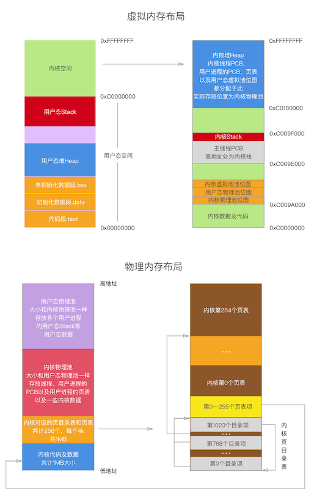
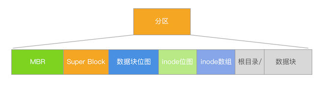
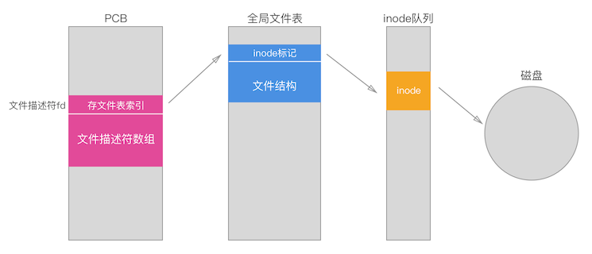

# toyOS
一个玩具OS, 32bit

思路和实现上参考了《操作系统真象还原》

最终目标是实现一个简易的可交互的Shell

__TO-DO List：__

- [x] 虚拟内存及内存管理
- [x] 内核级线程
- [x] 用户态进程
- [x] 文件系统
- [ ] 交互Shell

### 硬盘分区
一共分主次两个硬盘，系统本身安装于主盘，采用的是MBR的引导模式，MBR->Boot Loader->Kernnel的过程

`MBR`位于磁盘`LBA 0号扇区`开始的**1**个扇区内

`Boot Loader`位于磁盘`LBA 2号扇区`开始的**4**个扇区内

`Kernel`位于磁盘`LBA 9号扇区`开始的**200**个扇区内

文件系统实现在从盘。这里可能不是很合理，若是按照商业系统的逻辑应该是现实现文件系统，再在相应分区安装操作系统

### 虚拟内存及内存管理
内存分页，一页为4Kb

内存管理采用位图管理，分配内存时按大小区分，大于1024字节的直接按页分配

若是小于1024字节，则在按页分配arena的基础上，用arena中的空闲块链进行分配和控制

为了实现方便，虽然开启了分页机制，但是并没有实现内存页与磁盘上的交换功能

### 线程和进程
PCB为1页大小

线程的调度，核心本质是通过时钟中断控制ESP指针切换来切换PCB，优先级的体现在于每个线程的运行时间片的长短

进程的实现基于线程，其中TSS的选择上仿效Linux，采用单TSS备份0级栈以及0级栈指针的做法。和线程最大的不同是进程的PCB中拥有页表地址，这也正是进程和线程最大的不同，进程真正拥有自己的独立虚拟内存空间

调度上没有用什么高效的算法，直接用队列循环调度

### 文件系统
文件系统的实现模仿类Unix系统的inode

__文件系统布局__

__文件描述符与inode的对应__

分区限定inode数量4096个，CPU按块（簇）大小操作硬盘，一块设置为一扇区，512字节。
* 文件权限管理没有实现
* 文件类型，只包含文件夹和普通文件，并没有对普通文件进行细分
* 文件的stat，只包含inode编号、文件大小和文件类型三个字段
* 实现了文件操作的一些基本功能，如mkdir、pwd、cd等，详见fs.h
