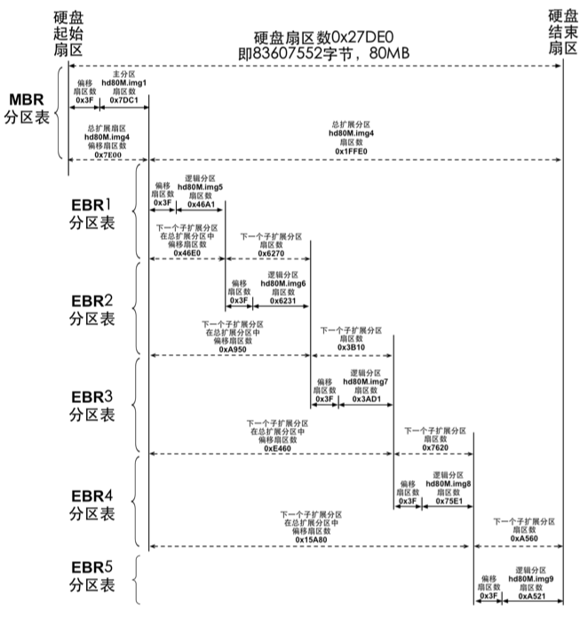

# my_os
一个纯粹的玩具OS

__TO-DO List：__

- [x] 虚拟内存及内存管理
- [x] 内核级线程
- [x] 用户态进程
- [ ] 文件系统
- [ ] 交互Shell

### 硬盘分区
一共分主次两个硬盘，系统本身安装于主盘

`MBR`位于磁盘`LBA 0号扇区`开始的**1**个扇区内

`Boot Loader`位于磁盘`LBA 2号扇区`开始的**4**个扇区内

`Kernel`位于磁盘`LBA 9号扇区`开始的**200**个扇区内

文件系统将安装于从盘, 分区如下（此分区图源于《操作系统真象还原》）

### 虚拟内存及内存管理
内存分页，一页为4Kb

内存管理采用位图管理，分配内存时按大小区分，大于1024字节的直接按页分配
若是小于1024字节，则在按页分配arena的基础上，用arena中的空闲块链进行分配和控制

### 线程和进程
PCB为1页大小

线程的调度，核心本质是通过时钟中断控制ESP指针切换来切换PCB，优先级的体现在于每个线程的运行时间片的长短

进程的实现基于线程，最大的不同是进程的PCB中拥有页表地址，这也正是进程和线程最大的不同，进程真正拥有自己的独立虚拟内存空间

调度上没有用什么高效的算法，直接用队列循环调度

### 文件系统
文件系统的实现模仿类Unix系统的inode

